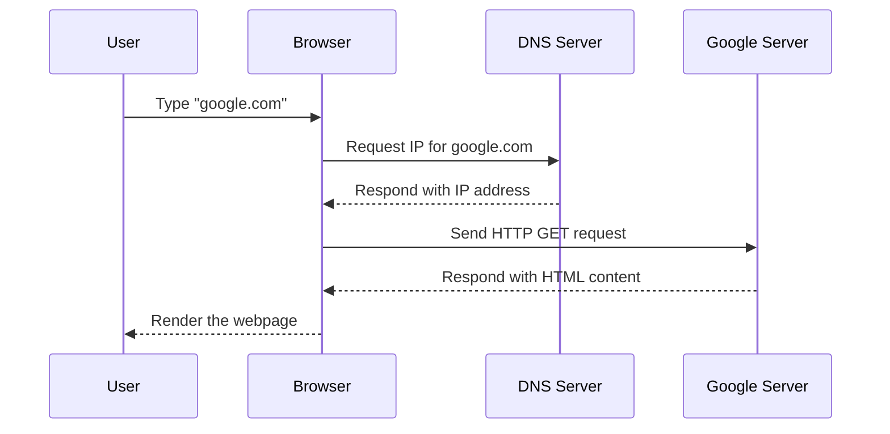

# 1.1: Web Development Fundamentals

Welcome to your full-stack development journey! This module lays the **foundation of how the web works** — an essential step before diving into frontend or backend code. You'll learn about the Internet, HTTP, DNS, servers, browsers, and the key difference between frontend and backend development.

We’ll also introduce you to the **role of a full-stack developer** with practical illustrations and hands-on tasks.

---

## 🌐 What is the Web?

The **World Wide Web (WWW)** is like a massive digital library. It’s a collection of web pages, multimedia, and documents, all interconnected through links and accessible via the Internet.

### 🧠 Think of it like this:
Imagine a vast library where each book (webpage) is identified by a unique code (URL). A librarian (browser) fetches and shows you the book when you ask for it.

### 🔍 Real-World Analogy:

```txt
You: Open browser → Type "google.com"
Browser: Sends request to Google’s server
Server: Sends back the webpage (HTML)
Browser: Displays it on your screen
````

---

## 🚀 How the Internet Works (Behind the Scenes)

Here’s a simplified flow of how your browser loads a webpage:



This process happens in milliseconds — that’s the magic of modern web technology.

---

## 📡 Key Components of the Web

| Term           | What It Means                                                             |
| -------------- | ------------------------------------------------------------------------- |
| **IP Address** | Like a home address for devices — used to locate servers on the internet. |
| **DNS**        | Translates human-friendly URLs (like `google.com`) into IP addresses.     |
| **HTTP/HTTPS** | Communication protocol used to transfer data between browser and server.  |
| **Browser**    | Tool (e.g., Chrome, Firefox) that displays web content.                   |
| **Web Server** | Stores and serves the content (like HTML/CSS files) when requested.       |

---

## 📬 HTTP in Action

**HyperText Transfer Protocol (HTTP)** is how your browser and the server communicate.

### 📤 HTTP Request Example:

```http
GET /index.html HTTP/1.1
Host: example.com
```

This means: "Dear example.com, please send me the index.html file."

### 📥 HTTP Response Example:

```http
HTTP/1.1 200 OK
Content-Type: text/html

<html>
  <body>Hello, world!</body>
</html>
```

The server responds with a status code (`200 OK`) and sends back HTML content.

---

## 🖥️ Frontend vs Backend

| Frontend                             | Backend                                   |
| ------------------------------------ | ----------------------------------------- |
| What users **see and interact with** | What powers the app **behind the scenes** |
| Runs in the **browser**              | Runs on the **server**                    |
| Built with **HTML, CSS, JS**         | Built with **Node.js, Python, Java**      |
| Handles UI, animations, events       | Handles logic, databases, APIs            |

### 🧠 Analogy:

Frontend is like the **visible showroom** of a shop. Backend is like the **stockroom and cash register system** behind it.

---

## 🔄 What is Full Stack Development?

A **Full Stack Developer** understands both frontend and backend and can build complete web applications — from designing beautiful UIs to setting up APIs and databases.

### ⚙️ Typical Full Stack Stack:

```txt
Frontend: React + TailwindCSS
Backend: Node.js + Express.js
Database: MongoDB
Hosting: Vercel / Render / Netlify
```

This tech stack enables you to develop, deploy, and scale full web applications end-to-end.

---

## 💻 Hands-On: Fetching Data

Let’s try a real-world action using the browser’s console:

### 🔧 Code:

```js
fetch("https://jsonplaceholder.typicode.com/posts/1")
  .then(res => res.json())
  .then(data => console.log(data));
```

### 🧪 What’s Happening?

* You're making an HTTP `GET` request to a public API.
* It returns a **JSON object** (a common format used in APIs).
* The browser logs the fetched post to the console.

✅ Open Chrome → Right-click → Inspect → Console → Paste & Run the code.

---

## 📚 Summary

Here's what you’ve learned in this section:

✅ The Web is a system of linked documents accessed via the Internet

✅ The Internet connects devices using IPs and DNS

✅ Browsers talk to servers using HTTP to fetch and render content

✅ Frontend is what users see; backend processes logic

✅ Full Stack Developers handle both sides for end-to-end development

---

## 🎯 Next Step

Now that you know **how the web works**, you're ready to dive deeper into **HTML, CSS, and JavaScript** — the essential tools for building engaging user interfaces.

Stay curious and code on! 🚀

