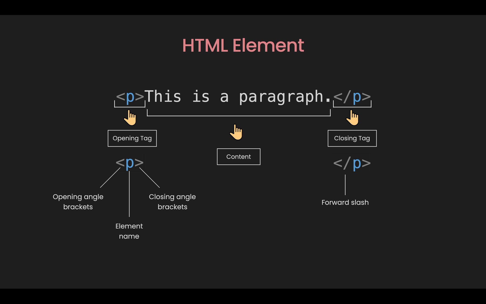
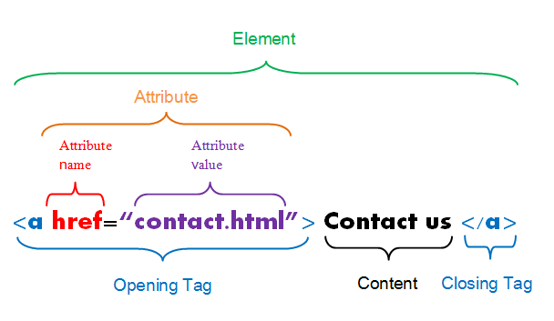

## 📌 2.2 HTML Elements – Building Blocks of the Web

---

HTML (**HyperText Markup Language**) is the standard language used to create web pages. It describes the **structure** and **content** of a webpage using **elements**.

---

### 🎯 What You'll Learn

* What are HTML elements and tags
* Common types of HTML elements
* Page structure using elements
* Nesting elements properly
* Real-world examples

---

### 🌐 What is an HTML Element?

An **HTML element** is a piece of content in a webpage wrapped with a **start tag** and an **end tag**, optionally including **attributes**.

### 🧱 Structure



```html
<tagname attribute="value">Content</tagname>
```

| Part        | Description |
| ----------  | ----------- |
| `<tagname>` | Opening tag |
| `attribute=value` | Attribute with value |
| `Content`   | Content     |
| `</tagname>`| Closing tag |

---

Example:



```html
<a href="contact.html">Contact us</a>
```

| Part         | Description                                 |
| ------------ | ------------------------------------------- |
| `<a>`        | Opening tag                                 |
| `href="..."` | Attribute providing a hyperlink destination |
| `Contact us`| Inner content                               |
| `</a>`       | Closing tag                                 |

---

### 📦 Categories of HTML Elements

#### 1️⃣ **Text Content**

| Element        | Use                                     |
| -------------- | --------------------------------------- |
| `<h1>`–`<h6>`  | Headings (importance from 1–6)          |
| `<p>`          | Paragraph                               |
| `<strong>`     | Strong importance (bold)                |
| `<em>`         | Emphasis (italic)                       |
| `<br>`         | Line break (no closing tag)             |
| `<hr>`         | Horizontal line                         |
| `<blockquote>` | Quoted text                             |
| `<pre>`        | Preformatted (respects spaces/newlines) |
| `<code>`       | Inline code snippets                    |

#### 🔤 Example

```html
<h1>Welcome</h1>
<p>This is a <strong>bold</strong> move in <em>HTML</em>.</p>
<code>npm install</code>
```

---

#### 2️⃣ **Grouping & Layout**

| Element     | Use                       |
| ----------- | ------------------------- |
| `<div>`     | Block-level container     |
| `<span>`    | Inline-level container    |
| `<section>` | Section of content        |
| `<article>` | Independent content block |
| `<header>`  | Page or section header    |
| `<footer>`  | Page or section footer    |
| `<nav>`     | Navigation links          |
| `<main>`    | Main page content         |
| `<aside>`   | Sidebar/secondary content |

#### 📦 Example

```html
<header>
  <h1>My Blog</h1>
</header>
<main>
  <article>
    <h2>First Post</h2>
    <p>Hello, world!</p>
  </article>
</main>
```

---

#### 3️⃣ **List Elements**

| Element | Use                      |
| ------- | ------------------------ |
| `<ul>`  | Unordered list           |
| `<ol>`  | Ordered list             |
| `<li>`  | List item                |
| `<dl>`  | Description list         |
| `<dt>`  | Term in description list |
| `<dd>`  | Description of the term  |

```html
<ul>
  <li>React</li>
  <li>Vue</li>
</ul>
```

---

#### 4️⃣ **Media Elements**

| Element    | Use                                  |
| ---------- | ------------------------------------ |
| ``    | Image (self-closing)                 |
| `<video>`  | Video player                         |
| `<audio>`  | Audio playback                       |
| `<source>` | Media source for `<video>`/`<audio>` |

```html

<video controls>
  <source src="demo.mp4" type="video/mp4" />
</video>
```

---

#### 5️⃣ **Form Elements**

| Element      | Use                   |
| ------------ | --------------------- |
| `<form>`     | Form container        |
| `<input>`    | Input field           |
| `<label>`    | Text label for input  |
| `<textarea>` | Multi-line text field |
| `<button>`   | Clickable button      |
| `<select>`   | Dropdown list         |
| `<option>`   | Option in dropdown    |
| `<fieldset>` | Group inputs          |
| `<legend>`   | Title for group       |

```html
<form>
  <label for="name">Name:</label>
  <input id="name" type="text" placeholder="Enter name" />
  <button type="submit">Submit</button>
</form>
```

---

### 🧠 Common HTML Attributes

| Attribute         | Applies To            | Purpose                   |
| ----------------- | --------------------- | ------------------------- |
| `id`              | All elements          | Unique identifier         |
| `class`           | All elements          | Reusable style hook       |
| `href`            | `<a>`                 | Link target               |
| `src`             | ``, `<video>`    | Media source              |
| `alt`             | ``               | Alt text (accessibility)  |
| `target="_blank"` | `<a>`                 | Opens link in new tab     |
| `disabled`        | `<input>`, `<button>` | Disables interaction      |
| `checked`         | `<input>`             | Pre-check radio/checkbox  |
| `required`        | `<input>`             | Makes field mandatory     |
| `placeholder`     | `<input>`             | Example text inside field |

---

### 🪞 Self-Closing Elements

These do **not** have a closing tag:

```html

<br />
<hr />
<input type="text" />
```

---

### 🧱 Real Page Structure Example

```html
<!DOCTYPE html>
<html lang="en">
<head>
  <meta charset="UTF-8" />
  <meta name="viewport" content="width=device-width, initial-scale=1.0" />
  <title>My Profile</title>
</head>
<body>
  <header>
    <h1>Zakeer’s Dev Journey</h1>
  </header>

  <main>
    <section>
      <h2>About Me</h2>
      <p>I’m a full-stack engineer who loves clean code and great UI.</p>
    </section>

    <section>
      <h2>Skills</h2>
      <ul>
        <li>JavaScript</li>
        <li>React</li>
        <li>Node.js</li>
      </ul>
    </section>
  </main>

  <footer>
    <p>Contact: zakeer@example.com</p>
  </footer>
</body>
</html>
```


---

### 🏗️ Nesting and Hierarchy

HTML supports **nested elements**:

```html
<ul>
  <li>HTML</li>
  <li>CSS</li>
  <li>JavaScript</li>
</ul>
```

Here, `<li>` tags are nested inside a `<ul>` list.

---

### 🔄 Block vs Inline Elements

| Type   | Examples                 | Characteristics                          |
| ------ | ------------------------ | ---------------------------------------- |
| Block  | `<div>`, `<p>`, `<h1>`   | Starts on a new line, takes full width   |
| Inline | `<span>`, `<a>`, `` | Flows within content, doesn't break line |

---

### 🧠 Special Attributes

* `id` – uniquely identifies an element
* `class` – applies styles or behaviors via CSS/JS
* `alt` – alternative text for images
* `href` – defines link destination (for `<a>`)
* `src` – defines image source (for ``)

---

### 🧪 Practice Task

Create a simple **"My Hobbies"** HTML structure:

```html
<h2>My Hobbies</h2>
<ul>
  <li>Reading</li>
  <li>Coding</li>
  <li>Photography</li>
</ul>
```

---

### 💡 Tips

* Always close tags (`</tag>`) unless it's self-closing (``, `<br />`)
* Use **semantic elements** (we’ll cover this soon)
* Avoid deeply nesting without structure—it hurts readability

---

## ✅ Summary

* HTML elements are the building blocks of web pages
* Most elements wrap content with opening/closing tags
* Learn the difference between block vs inline elements
* Attributes add meaning and behavior to elements


