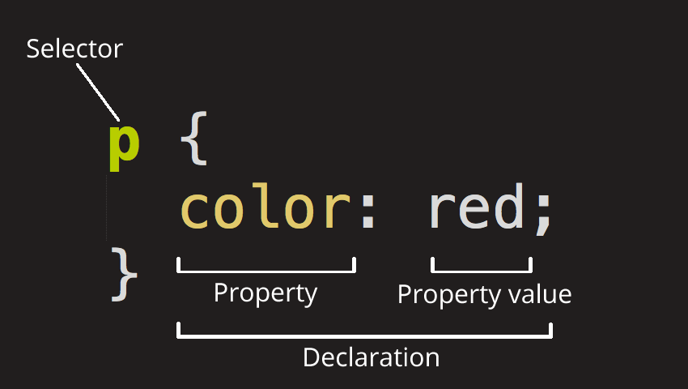

## 🎨 2.3 CSS & Query Selectors – Styling the Web

### 🌐 What is CSS?

**CSS** (Cascading Style Sheets) is used to style and layout HTML elements. It controls **how your webpage looks**—fonts, colors, spacing, positioning, animations, responsiveness, and more.

### 🔧 CSS Syntax

```css
selector {
  property: value;
}
```


#### Example:

`index.html`
```html
<p>Hello, CSS!</p>
```

`styles.css`
```css
p {
  color: red;
}
```

The HTML remains **semantic** (what the content *is*), while CSS handles **presentation** (how it *looks*).



---

### 🎯 What Can CSS Do?

* Change text color, size, and font
* Adjust margins, paddings, and layout
* Add borders, shadows, or backgrounds
* Control animations and transitions
* Make pages responsive across devices

---

### 💡 Where Do We Write CSS?

1. **Inline**
   Inside an HTML tag (not recommended):

   ```html
   <p style="color: red;">Inline CSS</p>
   ```

2. **Internal**
   Inside a `<style>` tag in HTML:

   ```html
   <style>
     p { color: red; }
   </style>
   ```

3. **External** ✅ Recommended
   In a separate `.css` file linked to HTML:

   ```html
   <link rel="stylesheet" href="styles.css" />
   ```

---

Now that we know *what* CSS does and *where* to write it, let’s move to:

---

## 🎯 2.3 Query Selectors – Selecting HTML Elements with CSS

---

### 🧭 What are Query Selectors?

CSS **selectors** target **HTML elements** so you can apply styles to them.

Think of it like:
👉 “I want to style all `<p>` tags red”
👉 “I want to style any element with class `.button`”

---

### 🔍 Types of CSS Selectors

---

#### 1️⃣ **Element Selector**

Targets all elements of a type.

```css
p {
  color: blue;
}
```

✅ Affects all `<p>` tags

---

#### 2️⃣ **Class Selector (`.`)**

Targets elements with a specific class.

```html
<p class="highlight">This is important</p>
```

```css
.highlight {
  color: red;
}
```

✅ Class is reusable across many elements.

---

#### 3️⃣ **ID Selector (`#`)**

Targets an element with a unique ID.

```html
<h1 id="main-title">Welcome</h1>
```

```css
#main-title {
  font-size: 36px;
}
```

❗ IDs should be unique per page.

---

#### 4️⃣ **Universal Selector (`*`)**

Selects **every** element.

```css
* {
  margin: 0;
  padding: 0;
}
```

✅ Often used for resets.

---

#### 5️⃣ **Group Selector**

Target multiple selectors at once.

```css
h1, h2, p {
  color: #333;
}
```

✅ Makes code cleaner when styles are shared.

---

#### 6️⃣ **Descendant Selector**

Targets elements *inside* others.

```html
<div class="box">
  <p>This will be blue</p>
</div>
```

```css
.box p {
  color: blue;
}
```

✅ Very useful for scoped styling.

---

#### 7️⃣ **Child Selector (`>`)**

Targets direct children only.

```css
nav > ul {
  background-color: #eee;
}
```

✅ More strict than descendant selector.

---

#### 8️⃣ **Attribute Selector**

Targets elements with specific attributes.

```css
input[type="text"] {
  border: 1px solid #ccc;
}
```

✅ Helps style form elements efficiently.

---

### 🧪 Practice: Style a Card

```html
<div class="card">
  <h2 class="title">Card Title</h2>
  <p class="description">This is a card description.</p>
</div>
```

```css
.card {
  border: 1px solid #ddd;
  padding: 16px;
  border-radius: 8px;
}

.title {
  color: navy;
}

.description {
  color: gray;
}
```

---

### 📚 Best Practices

* Use **class selectors** for styling (recommended)
* Reserve **IDs** for JavaScript targeting or anchors
* Keep selectors **specific but not overly deep**
* Prefer external CSS for better organization

---

## ✅ Summary

* CSS query selectors allow targeting HTML elements for styling
* Use element, class, and ID selectors often
* Combine selectors for specificity
* Practice nesting and grouping to manage complex UIs
