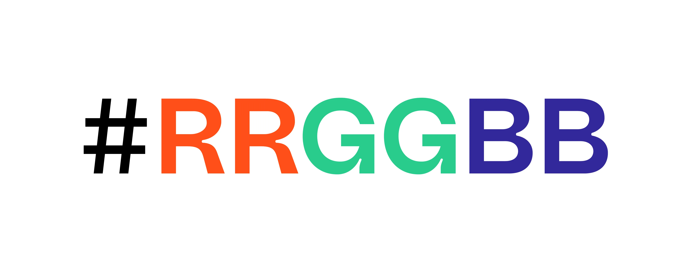
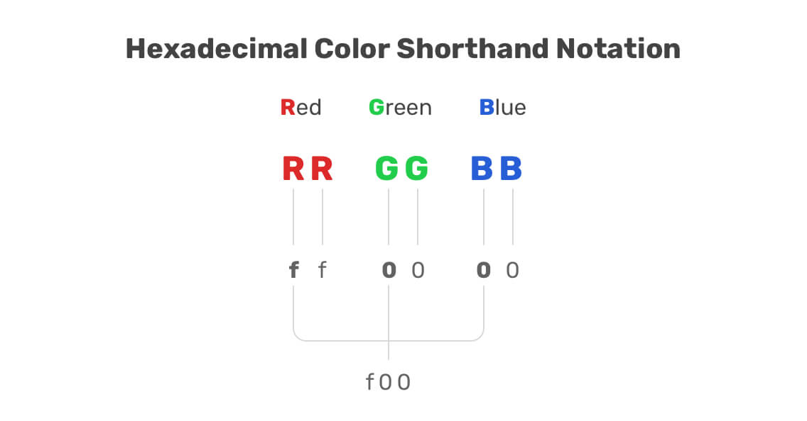
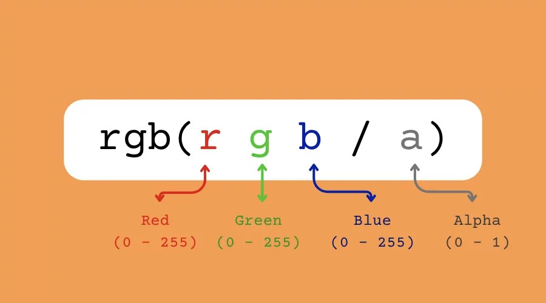
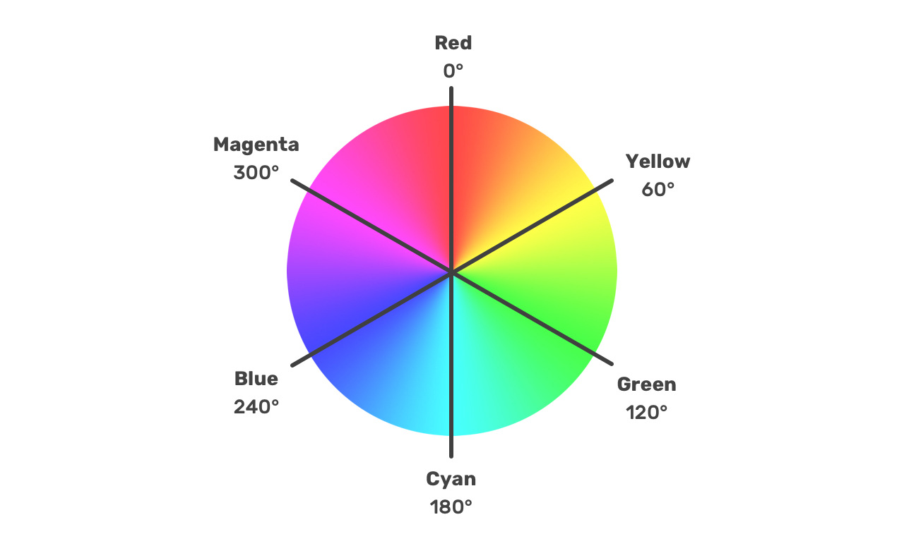
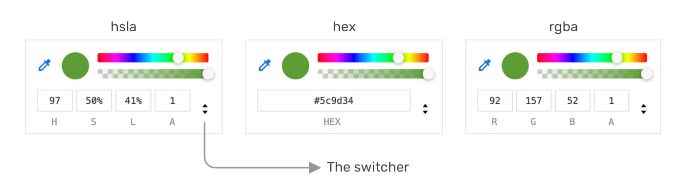

## 🎨 2.4 Colors – Deep Dive into CSS Colors & Color Theory

---

### 💡 Why Color Matters in UI/UX

* **Visual hierarchy**: Guide users’ attention
* **Brand identity**: Consistency across platforms
* **Accessibility**: Ensure readability for all users
* **Emotional impact**: Colors evoke moods

---

## 🔍 What is a HEX Color?

**HEX** stands for **Hexadecimal**, a base-16 numbering system used to represent **RGB color values**.



```css
color: #RRGGBB;
```

Each pair (RR, GG, BB) represents a value from `00` to `FF` (0–255 in decimal):

| HEX Pair  | Meaning                 | Example |
| --------- | ----------------------- | ------- |
| `#FF0000` | Full red, no green/blue | Red     |
| `#00FF00` | Full green              | Green   |
| `#0000FF` | Full blue               | Blue    |
| `#FFFFFF` | All full (white)        | White   |
| `#000000` | All zero (black)        | Black   |

✅ **Shorthand** HEX:

```css
color: #f00; /* Same as #ff0000 */
```



---

## What is RGB?

**RGB** stands for **Red, Green, Blue**, a model based on light. Each channel accepts a value from `0` to `255`.



```css
color: rgb(255, 0, 0); /* Red */
color: rgb(0, 255, 0); /* Green */
color: rgb(0, 0, 255); /* Blue */
```

The channels combine to form millions of possible colors.

---

### ✨ RGB Breakdown

| Color      | R   | G   | B   |
| ---------- | --- | --- | --- |
| **White**  | 255 | 255 | 255 |
| **Black**  | 0   | 0   | 0   |
| **Gray**   | 128 | 128 | 128 |
| **Yellow** | 255 | 255 | 0   |
| **Teal**   | 0   | 128 | 128 |

---

## 🎯 RGB vs HEX – What's the Difference?

| Feature     | RGB                    | HEX                |
| ----------- | ---------------------- | ------------------ |
| Syntax      | `rgb(255, 0, 0)`       | `#FF0000`          |
| Use case    | JavaScript/Dynamic     | CSS/Design Tools   |
| Readability | More intuitive with JS | Shorter for design |

✅ Use **RGB** if you’re manipulating colors via JavaScript
✅ Use **HEX** when working in design or static CSS

---

## What is HSL?

**HSL** stands for **Hue, Saturation, Lightness**, a model based on light. Each channel accepts a value from `0` to `255`.



```css
color: hsl(200, 100%, 50%); /* Bright blue */
```

The channels combine to form millions of possible colors.

--- 

## 🌈 Color Theory Basics (Visual Design Primer)

### 🎨 1. Primary Colors (Digital: RGB)

* Red
* Green
* Blue

They form all other colors through **additive mixing**.

---

### 🎨 2. Secondary Colors

* Cyan = Green + Blue
* Magenta = Red + Blue
* Yellow = Red + Green

---

### 🎨 3. Complementary Colors

Opposite on the color wheel:

| Color  | Complement |
| ------ | ---------- |
| Blue   | Orange     |
| Red    | Green      |
| Purple | Yellow     |

> ✅ **Use complementary colors** for **visual contrast** (e.g., CTA buttons).

---

### Dev Tools


---

### 🧠 Practical Tip: Use Online Tools

* [https://coolors.co/](https://coolors.co/)
* [https://colorhunt.co/](https://colorhunt.co/)
* [https://color.adobe.com/](https://color.adobe.com/)
* [https://accessible-colors.com/](https://accessible-colors.com/)

---

## 🧪 Interactive Examples

```html
<div class="hex">HEX: #1abc9c</div>
<div class="rgb">RGB: rgb(52, 152, 219)</div>
<div class="contrast">Good Contrast</div>
```

```css
div {
  padding: 15px;
  margin: 10px;
  color: white;
  font-weight: bold;
  text-align: center;
  border-radius: 8px;
}

.hex {
  background-color: #1abc9c; /* turquoise */
}

.rgb {
  background-color: rgb(52, 152, 219); /* blue */
}

.contrast {
  background-color: #2c3e50; /* dark */
  color: #ecf0f1; /* light */
}
```

---

## 🧠 Contrast & Accessibility (WCAG Guidelines)

### ✅ Best Practices

* Use **light text on dark backgrounds** or vice versa
* Ensure color contrast ratio ≥ **4.5:1**
* Don’t use color as the **only** means to convey meaning

✅ Test tools:

* [WebAIM Contrast Checker](https://webaim.org/resources/contrastchecker/)
* Chrome DevTools → Lighthouse → Accessibility

---

### 💡 Use Opacity for Overlays

```css
.overlay {
  background-color: rgba(0, 0, 0, 0.6);
  color: white;
}
```

✅ Use `rgba()` when you want **transparent effects** for UI cards, modals, or banners.

---

## 🎨 Summary Table

| Format | Syntax          | Range          | Opacity | Use For                 |
| ------ | --------------- | -------------- | ------- | ----------------------- |
| HEX    | `#rrggbb`       | 00–FF          | ❌       | Web design & static CSS |
| RGB    | `rgb(r,g,b)`    | 0–255          | ❌       | JS-friendly CSS values  |
| RGBA   | `rgba(r,g,b,a)` | 0–255 + 0–1    | ✅       | Transparent overlays    |
| HSL    | `hsl(h,s%,l%)`  | 0–360°, 0–100% | ❌       | Tweak-friendly themes   |

---

## ✅ Summary Checklist

✅ Understand HEX vs RGB
✅ Know the role of color theory in UI
✅ Use tools to build your palette
✅ Respect accessibility contrast rules
✅ Use transparent colors with RGBA
✅ Test your choices in real browsers
