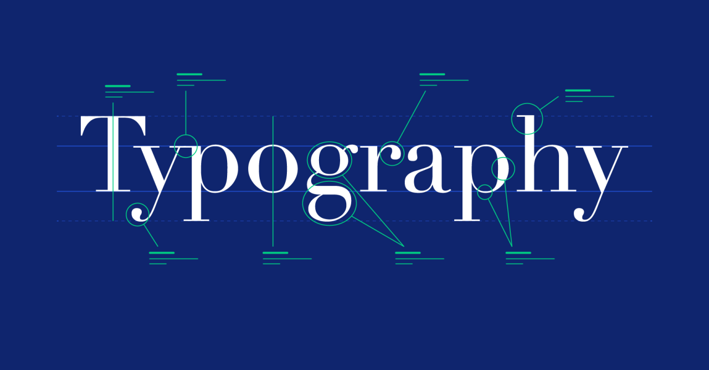

## ✒️ 2.5 Typography – Crafting Readable & Beautiful Text



---

Typography is the **art of arranging text**. In web design, it affects:

* **Readability**
* **Visual hierarchy**
* **User experience**
* **Brand perception**

In this section, we’ll explore:

1. CSS font properties
2. Font families & fallbacks
3. Font size, weight, style
4. Line-height & letter spacing
5. Google Fonts integration
6. Real-world examples
7. Best practices for readable UI

---

## 📘 1. Font Properties Overview

| Property         | Purpose                            |
| ---------------- | ---------------------------------- |
| `font-family`    | Type of font used                  |
| `font-size`      | Size of the text                   |
| `font-weight`    | Thickness (boldness)               |
| `font-style`     | Italic, normal, or oblique         |
| `line-height`    | Vertical spacing between lines     |
| `letter-spacing` | Horizontal spacing between letters |

---

## 🅰️ 2. Font Family & Fallbacks

```css
p {
  font-family: 'Segoe UI', Arial, sans-serif;
}
```

✅ Always list **fallbacks**. If one font isn’t available, the next one is used.

| Font Type    | Example                            |
| ------------ | ---------------------------------- |
| Web-safe     | Arial, Times New Roman             |
| Custom (web) | Google Fonts like Roboto           |
| Generic      | `serif`, `sans-serif`, `monospace` |

---

## 🔡 3. Font Size

Use `px`, `em`, or `rem`.

```css
h1 {
  font-size: 32px;
}
p {
  font-size: 1rem; /* 1rem = 16px by default */
}
```

| Unit  | Description                         |
| ----- | ----------------------------------- |
| `px`  | Fixed size                          |
| `em`  | Relative to parent element          |
| `rem` | Relative to root (`<html>`) element |

> ✅ Use `rem` for consistent scaling across devices.

---

## 💪 4. Font Weight

```css
p {
  font-weight: bold;       /* or numeric values */
}
```

| Value     | Description          |
| --------- | -------------------- |
| `normal`  | Default (400)        |
| `bold`    | Bold (700)           |
| `100–900` | Fine-grained control |

---

## ✍️ 5. Font Style

```css
em {
  font-style: italic;
}
```

| Value     | Description       |
| --------- | ----------------- |
| `normal`  | Regular           |
| `italic`  | Slanted style     |
| `oblique` | Similar to italic |

---

## 📏 6. Line Height & Letter Spacing

### Line Height

Improves **vertical spacing** and readability.

```css
p {
  line-height: 1.6;
}
```

### Letter Spacing

Controls space **between characters**.

```css
h1 {
  letter-spacing: 1px;
}
```

---

## 🌐 7. Google Fonts Integration

1. Go to [fonts.google.com](https://fonts.google.com)
2. Select / Roboto a font (e.g., "Roboto")
3. Click **Get Font → Get embed code**
4. Copy the `<link>` into `<head>`:

```html
<link href="https://fonts.googleapis.com/css2?family=Roboto:ital,wght@0,100..900;1,100..900&display=swap" rel="stylesheet">
```

5. Apply in CSS:

```css
body {
  font-family: "Roboto", sans-serif;
}
```

---

## 🧪 Example: Typography in Action

```html
<div class="typography-demo">
  <h1>Main Title</h1>
  <p class="sub">This paragraph has a custom font, size, and spacing to improve legibility.</p>
</div>
```

```css
.typography-demo {
  font-family: 'Segoe UI', sans-serif;
  line-height: 1.6;
}

h1 {
  font-size: 2.5rem;
  font-weight: 700;
  letter-spacing: 0.5px;
}

.sub {
  font-size: 1rem;
  color: #555;
}
```

✅ Result: Clean, readable, responsive text with visual hierarchy.

---

## 🎯 8. Typography Best Practices

| Practice                     | Why It Matters                             |
| ---------------------------- | ------------------------------------------ |
| Use `rem` instead of `px`    | Easier to scale across screen sizes        |
| Use web-safe or hosted fonts | Ensures availability                       |
| Avoid more than 2–3 fonts    | Keeps UI clean and professional            |
| Use readable base font size  | Start with 16px or 1rem                    |
| Use proper line height       | Prevents text from feeling cramped         |
| Respect contrast ratios      | Improves accessibility (e.g. #333 on #fff) |

---

## 🧠 Fun Tip: Use CSS Variables for Typography Themes

```css
:root {
  --font-main: 'Inter', sans-serif;
  --font-heading: 'Montserrat', sans-serif;
}

body {
  font-family: var(--font-main);
}

h1, h2 {
  font-family: var(--font-heading);
}
```

✅ Great for scaling styles in large projects.

---

## ✅ Summary

* `font-family`, `font-size`, `font-weight`, `line-height` control typography
* Use `rem` units for scalable text
* Integrate custom fonts via Google Fonts
* Maintain visual consistency through spacing & sizing
* Typography affects both **usability** and **design**

